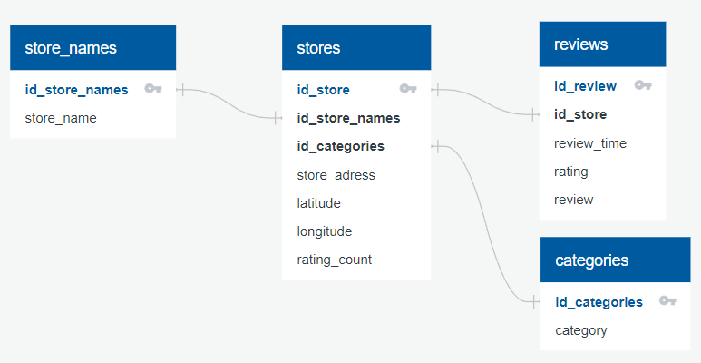

# Project 2

For the ETL mini project, you will work with a partner to practice building an ETL pipeline using Python, Pandas, and either Python dictionary methods or regular expressions to extract and transform the data. After you transform the data, you'll create four CSV files and use the CSV file data to create an ERD and a table schema. Finally, you’ll upload the CSV file data into a Postgres database.

Since this is a one-week project, make sure that you have done at least half of your project before the third day of class to stay on track.

Although you and your partner will divide the work, it’s essential to collaborate and communicate while working on different parts of the project. Be sure to check in with your partner regularly and offer support.

### Before You Begin

- Have one member of your group create a new repository, named FastFood_ETL, for this project. Add your partner as a collaborator. Do not add this project to an existing repository.
- Clone the new repository to your computer.
- Have one person rename the ETL_Mini_Project_starter_code.ipynb file with the first name initial and last name of each member of the group, for example, ETL_Mini_Project_NRomanoff_JSmith.ipynb. Then, add this Jupyter notebook file and the Resources folder containing the McDonald_s_Reviews.csv to your repository.
- Push the changes to GitHub.
- Have your partner pull the changes, so both of you have the same notebook available on your computer.
- As you work through the project deliverables, you may find it helpful to break up the work across other notebooks that you each work on individually. However, once complete, please combine all the subsections back into the final ETL_Mini_Project notebook.

### Instructions

The instructions for this mini project are divided into the following subsections:

- Create the store_names DataFrame
- Create the categories DataFrame
- Create the stores DataFrame
- Create the reviews DataFrame
- Create the FasFootReview Database

### Create the store_names DataFrame

Extract and transform the `McDonald_s_Reviews.csv` data to create a `store_names` DataFrame that has the following columns:

- id_store_names (values going sequentially from 0 to `n`, where `n` is the number of unique store_name)
- store_name

Export the Stores DataFrame as `store_names.csv` and save it to your GitHub repository.

### Create the categories DataFrame

Extract and transform the `McDonald_s_Reviews.csv` data to create a `categories` DataFrame that has the following columns:

- id_categories (values going sequentially from 0 to `n`, where `n` is the number of unique category)
- category

Export the Stores DataFrame as `categories.csv` and save it to your GitHub repository.

### Create the stores DataFrame

Extract and transform the `McDonald_s_Reviews.csv` data to create a `stores` DataFrame that has the following columns:

- id_store (values going sequentially from 0 to `n`, where `n` is the number of unique store)
- id_store_names (corresponding id from `store_names`)
- id_categories (corresponding id from `categories`)
- store_adress
- latitude
- longitude
- rating_count

Export the Stores DataFrame as `stores.csv` and save it to your GitHub repository.

### Create the reviews DataFrame

Extract and transform the `McDonald_s_Reviews.csv` data to create a `reviews` DataFrame that has the following columns. **Use regular expressions to fix `review_time` and `rating`**

- id_review (values going sequentially from 0 to `n`, where `n` is the number of unique reviews)
- id_store (corresponding id from `stores`)
- review_time (Values SHOULD NOT be strings, be sure to transform data to your best judgement into integers)
- rating (Values SHOULD NOT be strings, be sure to transform data to your best judgement into integers)
- review

Export the Stores DataFrame as `reviews.csv` and save it to your GitHub repository.

### Create the FasFootReview Database

1. Inspect the four CSV files, and then sketch an ERD of the tables by using QuickDBD
2. Use the information from the ERD to create a table schema for each CSV file.
    Note: Remember to specify the data types, primary keys, foreign keys, and other constraints.
3. Save the database schema as a Postgres file named FasFootReview.sql, and save it to your GitHub repository.
4. Create a new Postgres database, named FasFootReview_db.
5. Using the database schema, create the tables in the correct order to handle the foreign keys.
6. Verify the table creation by running a SELECT statement for each table.
7. Import each CSV file into its corresponding SQL table.
8. Verify that each table has the correct data by running a SELECT statement for each.

## Requirements

- A store_names DataFrame is created ( 15 points)

- A categories DataFrame is created ( 15 points)

- A stores DataFrame is created ( 30 points)

- A reviews DataFrame is created ( 15 points)

- A FasFootReview Database is Created (25 points)

All dataframes need to be exported to `csv` file format.

This project will be evaluated against the requirements and assigned a grade according to the following table:

| Grade   | Points |
|---------|--------|
| A (+/-) | 90+    |
| B (+/-) | 80–89  |
| C (+/-) | 70–79  |
| D (+/-) | 60–69  |
| F (+/-) | < 60   |